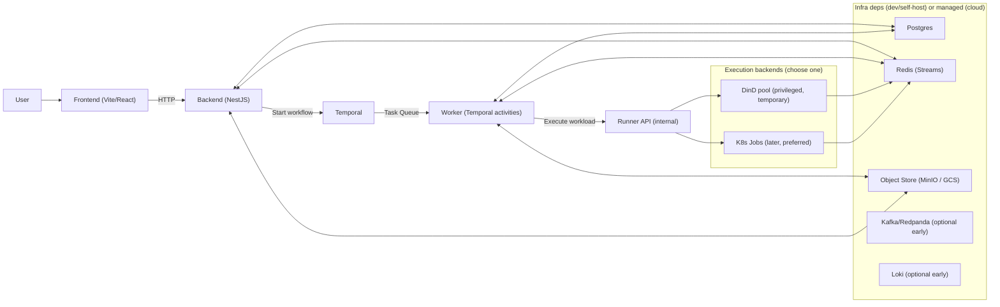

# ShipSec Studio: GCP-Target Architecture (Local First, Cloud Next)

**Last updated:** 2026-02-08

This doc is the "fresh" architecture + rollout plan optimized for:

- 2-3 early customers
- fast + reliable UX (especially workflow execution and terminal streaming)
- sane security defaults (with a realistic DinD-first transition plan)
- GCP as the first serious production target

It is intentionally specific enough that an agent (or a human) can implement the manifests and runbooks without guessing.

---

## 1) What we should start with (first thing)

Start by making **one reliable execution path** work end-to-end:

- Temporal workflow runs
- Worker executes a Docker-tool workload (via DinD initially)
- Terminal streaming works in the UI (Redis Streams -> Backend SSE -> xterm.js)
- Artifacts persist (S3-compatible first; GCS later)

Everything else (ingest services, full observability, multi-tenant isolation) is secondary until this path is solid.

**Why:** reliability comes from reducing degrees of freedom. Once we can repeatedly run real workloads and see their output, the rest becomes incremental hardening.

---

## 2) Target architecture (GCP-ready, DinD-first)

### 2.1 Control plane vs data plane

- **Control plane (ShipSec)**: API + Temporal + Worker(s) + Runner.
- **Data plane (customer / target environments)**: where scans run against targets. For now, scans run inside our cluster; later we can support remote runners.

### 2.2 High-level diagram

### 2.3 Who owns what (this answers the "worker or backend?" question)

- **Backend (API)** owns: user-facing config, auth, rate limits, tenancy, run metadata, and "what should run" (workflow definitions).
- **Temporal** owns: orchestration durability and retries.
- **Worker** owns: "turn workflow steps into side effects" (activities), including calling the Runner, passing env, persisting results.
- **Runner** owns: "how to run a workload" (DinD today, K8s Job tomorrow), plus streaming + cancellation.

If you skip Runner in v0, then the **Worker temporarily owns the Runner responsibilities** (it talks directly to DinD / Docker host). That makes the Worker fat and hard to harden later. The whole point of the Runner pattern is to centralize execution so you can change backends without rewriting the Worker.

---

## 3) Workload Runner pattern (end-to-end, step-by-step)

This is the clean model we want to converge to.

### 3.1 API request -> workflow

1. User clicks "Run" in the UI.
2. Frontend calls `POST /runs` (backend).
3. Backend writes run metadata to Postgres.
4. Backend starts a Temporal workflow with `{ runId, workflowSpec, inputs }`.

### 3.2 Workflow -> worker activities

5. Temporal schedules activities to the Worker on a task queue.
6. Worker resolves the component graph (what tools to run, in what order).

### 3.3 Activity -> runner execution

7. Worker calls Runner: `POST /executions` with:
   - `runId`, `stepId`
   - container image, command/args
   - env vars (non-secret) and references to secrets (secret IDs, not raw values)
   - artifact inputs/outputs (object store paths)
   - resource class (cpu/mem) + timeout
   - streaming channel identifiers (`terminal:<runId>:<stepId>`)
8. Runner creates the actual workload:
   - **DinD backend:** `docker run ...` against `DOCKER_HOST` pointing at the DinD pool.
   - **K8s Job backend:** creates a namespaced Job/Pod with a dedicated serviceAccount + pod sandboxing options.
9. Runner streams stdout/stderr into Redis Streams in small chunks.
10. Runner reports status transitions back to the Worker (`running`, `succeeded`, `failed`, `canceled`) with a final summary (exit code, artifact paths).
11. Worker records results in Postgres and proceeds to the next step.

### 3.4 Terminal streaming (one clean path)

12. Backend serves `GET /runs/:id/terminal` as **SSE** (or WebSocket later).
13. Backend tails the Redis Stream and pushes events to the browser.
14. Frontend renders it via xterm.js.

Key reliability properties:

- **Redis Streams is the buffer**: short disconnects do not lose output.
- **RunId+StepId partitioning**: avoids hot keys and makes backpressure manageable.
- **Chunk size + maxlen**: prevents unbounded memory.

### 3.5 Cancellation (must be real)

15. User hits "Cancel".
16. Backend signals Temporal to cancel the workflow.
17. Worker calls Runner `POST /executions/:id/cancel`.
18. Runner kills the container (DinD) or deletes the Job (K8s).
19. Runner emits a final `canceled` terminal event and status.

---

## 4) Terminal streaming design (practical details)

### 4.1 Stream format

Use a stable schema, even for v0:

- stream key: `terminal:<runId>:<stepId>`
- fields per entry:
  - `ts` (unix ms)
  - `stream` (`stdout` | `stderr` | `meta`)
  - `chunk` (text; cap size, e.g. 4-16KB)

### 4.2 Backpressure and retention

- Cap stream length: `MAXLEN ~ 5k-50k entries` depending on chunk sizing.
- Add TTL on stream keys (e.g. 7-30 days) for self-host sanity.
- Backend SSE should support:
  - `from=0` (start)
  - `from=lastId` (resume)

### 4.3 "Fast and reliable" UX knobs

Fast UX is mostly:

- keep images warm (pre-pull)
- avoid dynamic PV provisioning for every job early
- keep streaming real-time even if logs store is down (Redis is the primary buffer)

---

## 5) Execution backends: DinD now, K8s Jobs soon

### 5.1 DinD (today)

Pros:

- simplest path from existing Worker model (docker CLI everywhere)
- easiest to debug
- fastest to get real customer signal

Cons:

- requires `privileged` somewhere (high risk)
- disk usage can explode (`/var/lib/docker`)
- isolation is weaker (multi-tenant risk)

DinD must be treated as **single-tenant or "trusted tenant" only**.

### 5.2 K8s Jobs + sandboxing (target)

Pros:

- strong operational isolation primitives (namespaces, quotas, serviceAccounts)
- easier to meter (cpu/mem/time per job)
- cleaner path to multi-tenant (still non-trivial, but possible)

Cons:

- more moving pieces (RBAC, volumes, scheduling)
- cold starts can be slower if images aren’t local

### 5.3 Is gVisor a GKE default?

No. In GKE, gVisor is typically provided via **GKE Sandbox** and must be explicitly enabled/used (it is not the default for all pods). See: [GKE Sandbox overview](https://cloud.google.com/kubernetes-engine/docs/concepts/sandbox-pods) and [gVisor docs](https://gvisor.dev/docs/).

---

## 6) Disk issue (what to do about it)

This is mostly a DinD problem.

### 6.1 What causes it

- image layers accumulate
- tool containers write large outputs
- cached templates/signatures grow (e.g. nuclei templates, vuln DBs)

### 6.2 DinD mitigations (v0/v1)

- Put DinD on its own node pool (later in GKE), with a known disk size.
- Put `/var/lib/docker` on a PVC (already in the chart), and set:
  - aggressive log rotation
  - periodic `docker system prune` (carefully, with thresholds)
- Put a hard size limit on outputs per run (artifact budget).
- Prefer `emptyDir` for per-execution scratch, and upload artifacts to object store.

### 6.3 K8s Job runner mitigation (v2)

- Use `emptyDir` for scratch with `sizeLimit`.
- Use object store for all durable artifacts (GCS).
- Optional: per-job ephemeral PVC only when needed (but expect extra latency).

---

## 7) Risks of Worker having DinD (and "safe DinD in K8s pod?" question)

### 7.1 Main risks

- `privileged` pods can escape and compromise the node.
- docker socket exposure equals root on the node.
- resource accounting is messy (containers spawned by DinD don’t map cleanly to K8s QoS).
- disk pressure can take down the node and all tenants.

### 7.2 "Safe way" to run Docker in Kubernetes?

There is no fully "safe" DinD for multi-tenant untrusted workloads.

The pragmatic "less bad" version:

- isolated node pool (taints/tolerations)
- no other workloads on those nodes
- strict egress controls
- tight CPU/mem limits
- strong authentication between Worker/Runner and DinD
- fast path to replacing DinD with K8s Jobs

### 7.3 Official references

- Docker `dind` image: [docker:dind on Docker Hub](https://hub.docker.com/_/docker)
- Kubernetes privileged containers and pod security: [Kubernetes Pod Security Standards](https://kubernetes.io/docs/concepts/security/pod-security-standards/) and [Security Context](https://kubernetes.io/docs/tasks/configure-pod-container/security-context/)

---

## 8) Latency (DinD vs K8s Jobs vs gVisor): practical numbers

These are reality-based ranges, not guarantees. The biggest factor is **image pull** and **volume provisioning**.

### 8.1 Typical startup breakdown (warm images, no PVC provision)

- Docker on a single VPS: ~200ms to ~1500ms to start a container.
- K8s Job on an existing node: ~500ms to ~3000ms (scheduler + runtime + CNI).
- K8s Job with gVisor: often +100ms to +500ms overhead, plus some CPU overhead depending on syscalls.

### 8.2 Cold starts (image not present)

- Add **seconds to minutes** depending on image size and registry throughput.

### 8.3 Unshared/dynamic PV per job

- Add ~3s to ~30s depending on CSI driver and cloud disk provisioning.

If we want a "fast" product feel early:

- pre-pull common tool images
- keep scratch on `emptyDir`
- avoid per-job PV unless absolutely necessary

Reference for how Kubernetes measures pod startup latency: [Kubernetes SIG Scalability: Pod Startup Latency](https://github.com/kubernetes/perf-tests/blob/master/clusterloader2/testing/experiments/pod_startup_latency/README.md).

---

## 9) Deployment strategy: local first, then GCP (yes)

### Why this order works

- Local (or VPS+kind) proves the manifests and runner model cheaply.
- Generic cloud support keeps self-hosters happy and avoids lock-in.
- GCP integration (Terraform, managed services, Workload Identity, NAT) belongs in a private repo if it’s part of the paid offering.

---

## 10) Helm vs Kustomize (what to use)

Use **Helm** for the "product chart" surface area.

Reasons:

- values-driven toggles for managed vs in-cluster deps are simpler
- easier to ship one chart to self-hosters
- easier to template secrets/config consistently across namespaces

Use **Kustomize** only as a thin overlay layer if we later need environment-specific patching without re-expressing values.

This repo already started Helm under `deploy/helm/`.

---

## 11) Open-source vs private repo (self-host strategy)

Recommended split:

- **Open-source repo (`shipsec-studio`)**:
  - Helm charts for app + dev infra (`deploy/helm/shipsec`, `deploy/helm/shipsec-infra`)
  - generic Kubernetes docs (bring-your-own DB/Redis/object store)
  - clearly marked "DinD is not safe for multi-tenant production"
- **Private repo (`shipsec-studio-cloud`)**:
  - GCP Terraform/Pulumi
  - opinionated GKE node pools (including isolated execution pools)
  - External Secrets Operator wiring to Secret Manager
  - Cloud Armor/Gateway policies, NAT/IP allowlists, CI/CD
  - higher-value integrations and enterprise features

This gives self-hosters a complete path while keeping the "easy GCP production button" as part of the paid product.

---

## 12) GCP cost model (2-3 customers, DinD initially)

This is a rough model to sanity-check unit economics. Actual costs depend heavily on tool images, scan duration, and egress.

### 12.1 Biggest cost drivers

- compute for execution (DinD nodes)
- database (Cloud SQL)
- NAT egress (when talking to the public internet)
- logging/metrics (can get expensive if noisy)

### 12.2 A minimal-but-realistic GCP setup

- GKE Standard (1 cluster)
- 2 node pools:
  - `system` pool (backend/worker/temporal): small, steady
  - `exec` pool (DinD): bigger disks, isolated
- Managed services:
  - Cloud SQL for Postgres
  - Memorystore for Redis
  - GCS for artifacts
  - Artifact Registry for images
- Optional early: skip Loki + Kafka; rely on Redis Streams + Postgres + object store

### 12.3 NAT fees and avoiding NAT

Cloud NAT generally charges for:

- the NAT gateway itself (per hour)
- processed data (per GiB)

Docs:

- GCP Cloud NAT pricing: https://cloud.google.com/vpc/network-pricing#cloud-nat
- AWS NAT Gateway pricing: https://aws.amazon.com/vpc/pricing/

How to reduce NAT:

- keep as much traffic as possible on Google private paths:
  - use Artifact Registry and pull images via private Google access where available
  - store artifacts in GCS (private)
  - use Cloud SQL + Memorystore privately
- but any egress to the public internet (GitHub, target websites, public APIs) will still traverse NAT if your cluster has no public IPs

In practice, "can traffic go without NAT?" depends on whether the destination is reachable privately inside the VPC. Public internet: no, you need NAT (or public IPs).

---

## 13) Product unit economics (AI + compute)

### 13.1 Token usage for code review jobs

Tokens are dominated by:

- PR diff size (files changed + context)
- tool output grounding (static scanner results, SARIF, dependency graphs)
- final review/comment payload

Typical ballpark:

- small PR: ~20k to ~80k tokens end-to-end
- medium PR: ~80k to ~250k tokens
- large PR: 250k+ tokens (needs chunking)

### 13.2 A simple pricing model that works early

- base subscription per seat/org
- include a monthly AI credit bucket
- charge overage as pay-as-you-go credits
- keep "compute minutes" separate for heavy cloud dev jobs (security fixer)

This avoids margin surprises when customers run huge PR reviews.

---

## 14) Two workflows you described (CI review + fixer): recommended shape

### 14.1 Security Review (PR CI)

1. Static pipeline (deterministic):
   - Semgrep/SAST
   - dependency vuln scan
   - IaC scan (if relevant)
   - secret scan
2. Agentic review:
   - reads the diff + static outputs
   - only calls extra tools when the static output is insufficient
   - produces a structured report
3. PR annotations:
   - comment on the PR with summary
   - inline comments only when confidence is high and location is precise

### 14.2 Security Fixer (manual trigger)

- spawn an isolated dev job (container) with repo checkout
- apply safe, mechanical fixes first (deps bump, config flags, obvious sanitization)
- run tests/lint
- push a branch and open a PR stacked on the user’s PR

This is a good fit for the Runner model because it’s "run a job, stream logs, upload artifacts".

---

## 15) Implementation phases (agent-executable checklist)

This is the concrete plan to go from "works on a VPS" -> "GCP production".

### Phase A: VPS (kind) smoke test (today)

- [ ] Run `deploy/scripts/vps/install.sh` on `clevervps`
- [ ] Run `deploy/scripts/vps/smoke.sh` and ensure all core pods become ready
- [ ] Port-forward backend + frontend + Temporal UI and confirm basic HTTP responses

### Phase B: Local (OrbStack K8s) dev loop (lightweight)

- [ ] Keep `shipsec-infra` on by default for local
- [ ] Make `SHIPSEC_BUILD_IMAGES=1` optional (use prebuilt images when available)
- [ ] Add a "minimal infra" profile that disables Redpanda and Loki unless needed

### Phase C: Cloud-generic hardening (still open-source)

- [ ] Add RBAC per component (least privilege)
- [ ] Add baseline NetworkPolicies
- [ ] Add probes everywhere (backend/worker/runner)
- [ ] Add resource profiles (dev/staging/prod)
- [ ] Add a clear DinD exit criteria section and warnings

### Phase D: GCP private repo (`shipsec-studio-cloud`)

- [ ] Terraform/Pulumi:
  - [ ] VPC + private subnets
  - [ ] private GKE + node pools (`system`, `exec`)
  - [ ] Cloud NAT + egress IPs
  - [ ] Cloud SQL, Memorystore, GCS, Artifact Registry
  - [ ] Workload Identity
  - [ ] External Secrets Operator wiring
- [ ] Values overlays:
  - [ ] `values-gcp-staging.yaml`
  - [ ] `values-gcp-prod.yaml`
- [ ] CI/CD (GitOps or pipeline) to deploy chart releases

---

## 16) Repo pointers (what already exists)

- Helm charts: `deploy/helm/shipsec`, `deploy/helm/shipsec-infra`
- VPS scripts: `deploy/scripts/vps/install.sh`, `deploy/scripts/vps/smoke.sh`
- OrbStack scripts: `deploy/scripts/orbstack/install.sh`, `deploy/scripts/orbstack/smoke.sh`

