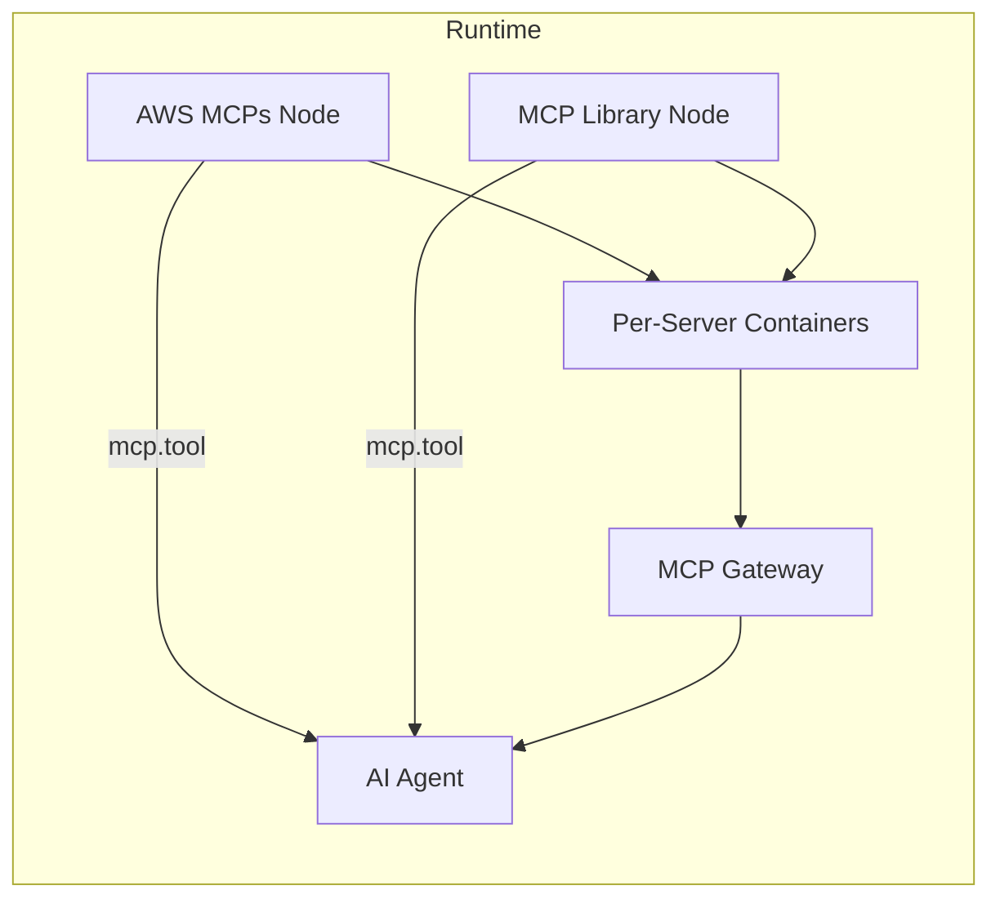
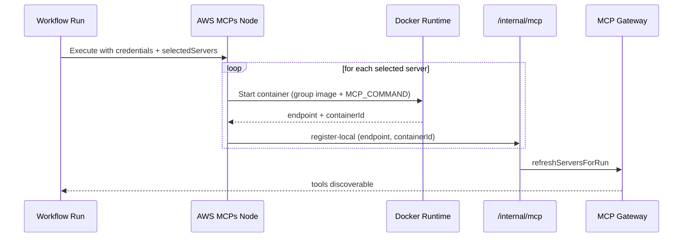

# MCP Library Redesign: Curated Groups + BYO Library (Per‑Server Containers)

Date: 2026-02-02
Owner: ShipSec Studio
Status: Draft for review

---

## 1) Executive Summary

We will redesign MCP to support **curated provider groups** (AWS, GitHub, GCP) while preserving the **BYO MCP Library**. Groups are **defined in code** (canonical list, credential contract, mapping, default images) and **materialized in DB** for org-level enablement and future customization. Workflows will use **group-specific nodes** (e.g., `AWS MCPs`) that allow selecting a **subset of servers** to avoid context bloat. Each selected server will run in its **own container** (no multiplex proxy yet).

This redesign replaces the current dedicated AWS MCP components (CloudTrail/CloudWatch) with a unified group node, and makes the MCP Library the BYO/ungrouped lane.

---

## 2) Current State (Validated in Repo)

### 2.1 MCP Library

- Persistent MCP server configs stored in Postgres (`mcp_servers`).
- Frontend `/mcp-library` page manages CRUD, health, tool discovery.
- Workflow `core.mcp.library` node selects enabled servers and registers them with the gateway at runtime.

### 2.2 Runtime Tooling

- Tools registered to Redis via `/internal/mcp/register-local`.
- MCP Gateway (`/mcp/gateway`) is the sole tool entry point.

### 2.3 AWS MCP Components

- Dedicated components: `security.aws-cloudtrail-mcp`, `security.aws-cloudwatch-mcp`.
- Use `core.credential.aws` input and per‑server Docker images.

### 2.4 Stdio Servers

- `shipsec/mcp-stdio-proxy` wraps stdio MCP servers and exposes HTTP.

---

## 3) Target State (What We’re Building)

### 3.1 Design Principles

- **Curated groups in code** for authoritative server lists and credential mapping.
- **DB-backed groups** for org-level enable/disable, metadata, and future customization.
- **Workflow-resolved credentials** to support STS/assume-role flows.
- **Per‑server containers** to keep scope and failure isolation clear.

### 3.2 Two Entry Points

- **Group Nodes**: AWS MCPs, GitHub MCPs, GCP MCPs
- **MCP Library**: BYO/ungrouped MCP servers

---

## 4) Architecture Diagrams

### 4.1 High-Level Workflow Diagram



### 4.2 Group Node Runtime Flow (Per-Server Containers)



### 4.3 Group + BYO Model

```mermaid
flowchart TB
  subgraph Curated Groups (Code Templates)
    G1[AWS Group Template]
    G2[GitHub Group Template]
    G3[GCP Group Template]
  end

  subgraph DB
    MG[mcp_groups]
    MGS[mcp_group_servers]
    MS[mcp_servers]
  end

  G1 --> MG
  G2 --> MG
  G3 --> MG
  MG --> MGS
  MS --> MGS
  MS -->|groupId = null| BYO[Ungrouped MCPs]
```

---

## 5) Data Model (Draft)

### 5.1 New Tables

**`mcp_groups`**

- `id` (uuid)
- `slug` (string, unique)
- `name`
- `description`
- `credentialContractName` (e.g., `core.credential.aws`)
- `credentialMapping` (json)
- `defaultDockerImage`
- `enabled` (boolean)
- `createdAt`, `updatedAt`

**`mcp_group_servers`**

- `groupId`
- `serverId`
- `recommended` (boolean)
- `defaultSelected` (boolean)

### 5.2 Existing Table Changes

**`mcp_servers`**

- Add `groupId` (nullable)
- Grouped servers are curated (read‑only) in UI

---

## 6) Group Templates (Code-Defined)

### 6.1 Example: AWS Group Template

```ts
export const AwsGroupTemplate = {
  slug: 'aws',
  name: 'AWS MCPs',
  description: 'Curated AWS MCP servers (CloudTrail, CloudWatch, ...)',
  credentialContractName: 'core.credential.aws',
  defaultDockerImage: 'shipsec/mcp-aws-suite:latest',
  credentialMapping: {
    env: {
      AWS_ACCESS_KEY_ID: 'accessKeyId',
      AWS_SECRET_ACCESS_KEY: 'secretAccessKey',
      AWS_SESSION_TOKEN: 'sessionToken?',
      AWS_REGION: 'region?',
    },
    awsFiles: true,
  },
  servers: [
    { id: 'aws-cloudtrail', command: 'awslabs.cloudtrail-mcp-server' },
    { id: 'aws-cloudwatch', command: 'awslabs.cloudwatch-mcp-server' },
  ],
};
```

---

## 7) Runtime Behavior (Group Nodes)

### 7.1 Inputs + Params

- **Input**: credential contract (e.g., `core.credential.aws`)
- **Param**: `enabledServers[]` (multi-select from group servers)

### 7.2 Execution Steps

1. Resolve credentials (provided by workflow).
2. For each enabled server:
   - Start container using group image.
   - Set `MCP_COMMAND` (server command) and `MCP_ARGS` if needed.
   - Mount AWS credentials/config via `IsolatedContainerVolume`.
3. Register each server with `/internal/mcp/register-local`.

### 7.3 Tool Naming

Gateway prefixes tool names by MCP source. This prevents collisions:

- `aws-cloudtrail__lookup_events`
- `aws-cloudwatch__list_metrics`

---

## 8) Docker Strategy

### 8.1 Group Images

- Build one image per provider:
  - `shipsec/mcp-aws-suite:latest`
  - `shipsec/mcp-github-suite:latest`
  - `shipsec/mcp-gcp-suite:latest`
- Each image includes all server binaries.
- Each container runs **one** server (selected via `MCP_COMMAND`).

### 8.2 Why per-server containers (Phase 1)

- Simple isolation and troubleshooting.
- Avoids complex multiplex proxy at launch.
- Easier to map tool prefixes to a single source.

---

## 9) Frontend UX

### 9.1 New Nodes

- `AWS MCPs`
- `GitHub MCPs`
- `GCP MCPs`

### 9.2 Group Node Config

- Multi-select for group servers.
- Optional display of health + tool count.

### 9.3 MCP Library Page

- Continues to serve BYO MCPs.
- Grouped servers are read‑only (if shown).

---

## 10) Migration Plan

### Phase 0: Alignment

- Confirm curated server lists for AWS/GitHub/GCP.
- Define credential mapping for each group.

### Phase 1: Data Model + Seeding

- Add tables and `groupId`.
- Seed curated groups and servers from code templates.

### Phase 2: API Layer

- Group endpoints for UI and workers.

### Phase 3: Worker Components

- Add group runtime helper.
- Implement AWS MCP group node first.

### Phase 4: Docker Images

- Build provider group images.

### Phase 5: Frontend Integration

- Add group nodes + config UI.

### Phase 6: Deprecate Old AWS MCP Components

- Mark as deprecated and update docs/examples.

---

## 11) Risks & Mitigations

- **Curated group drift vs DB**
  - Mitigation: deterministic seeding with version stamp.

- **Large images**
  - Mitigation: provider-specific images; only install necessary servers.

- **Tool name collisions**
  - Mitigation: gateway prefixing enforced.

- **Cred mapping errors**
  - Mitigation: unit tests per group mapping.

---

## 12) Open Questions (For Review)

1. Should curated servers appear in MCP Library UI as read‑only or only via group nodes?
2. Do we allow per-server overrides (args/env) in group node UI or keep template-fixed?
3. Should group nodes expose optional params like region overrides?
4. How should org-level enable/disable be handled for curated groups?
5. Should health polling be centralized on MCP Library page for both grouped + ungrouped?

---

## 13) Acceptance Criteria (Phase 1)

- AWS MCP group node available in workflow palette.
- User can select a subset of AWS MCP servers.
- Each selected server runs in a container using group image.
- Tools appear via gateway and are callable by AI agents.
- MCP Library remains intact for BYO servers.

---

## 14) Future Work

- Multiplex proxy (single container, multiple stdio servers).
- User-defined groups.
- Group presets by workflow type.
