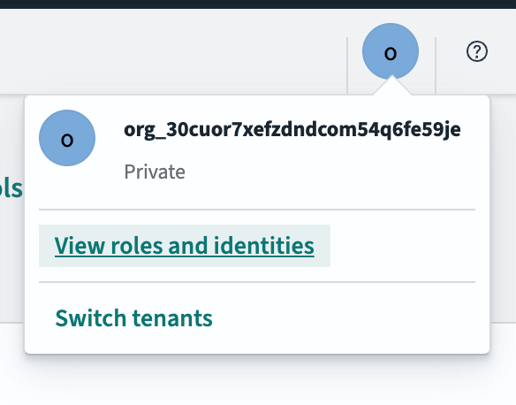
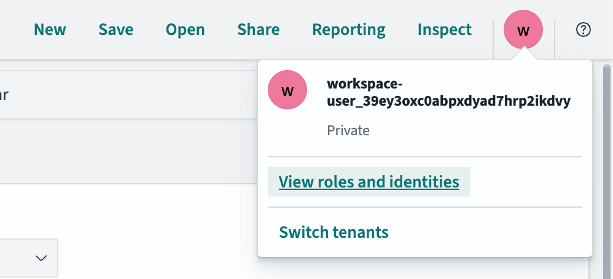
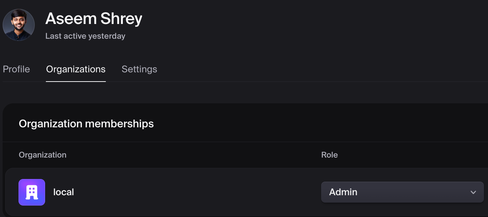
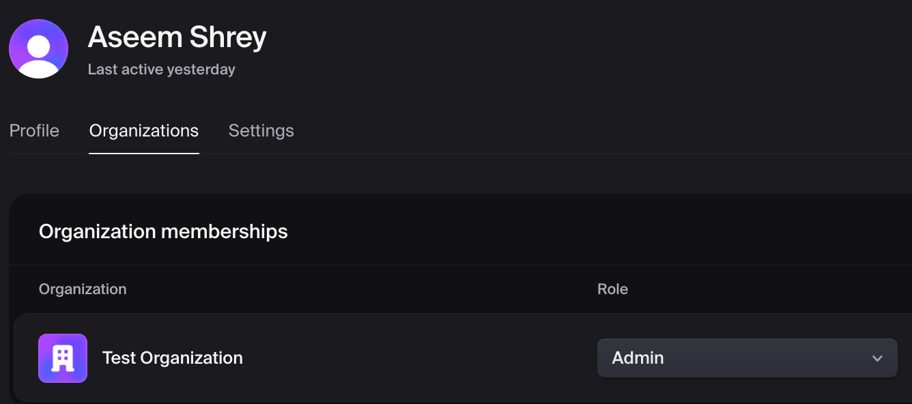

# Analytics Pipeline

This document describes the analytics infrastructure for ShipSec Studio, including OpenSearch for data storage, OpenSearch Dashboards for visualization, and the routing architecture.

## Architecture Overview

```
┌─────────────────────────────────────────────────────────────────────┐
│                         Nginx (port 80)                              │
│                                                                      │
│  /analytics/*  ──────►  OpenSearch Dashboards (5601)                │
│  /api/*        ──────►  Backend API (3211)                          │
│  /*            ──────►  Frontend SPA (8080)                         │
└─────────────────────────────────────────────────────────────────────┘
                                    │
                                    ▼
┌─────────────────────────────────────────────────────────────────────┐
│                         Worker Service                               │
│                                                                      │
│  Analytics Sink Component  ──────►  OpenSearch (9200)               │
│  (OPENSEARCH_URL env var)                                           │
└─────────────────────────────────────────────────────────────────────┘
```

## Components

### OpenSearch (Port 9200)

Time-series database for storing security findings and workflow analytics.

**Configuration:**

- Single-node deployment (dev/simple prod)
- Security plugin disabled for development
- Index pattern: `security-findings-{org-id}-{date}`

### OpenSearch Dashboards (Port 5601)

Web UI for exploring and visualizing analytics data.

**Configuration (`opensearch-dashboards.yml`):**

```yaml
server.basePath: '/analytics'
server.rewriteBasePath: true
opensearch.hosts: ['http://opensearch:9200']
```

**Key Settings:**

- `basePath: "/analytics"` - All URLs are prefixed with `/analytics`
- `rewriteBasePath: true` - Strips `/analytics` from incoming requests, adds it back to responses

### Analytics Sink (Worker Component)

The `core.analytics.sink` component writes workflow results to OpenSearch.

**Input Ports:**

- Ships with a default `input1` port so at least one connector is always available.
- Users can configure additional input ports via the **Data Inputs** parameter
  (e.g., to aggregate results from multiple scanners into one index).
- Extra ports are resolved dynamically through the `resolvePorts` mechanism. When
  loading a saved workflow the backend calls `resolveGraphPorts()` server-side;
  when importing from a JSON file the frontend calls `resolvePorts` per-node to
  ensure all dynamic handles are present before rendering.

**Environment Variable:**

```yaml
OPENSEARCH_URL=http://opensearch:9200
```

**Document Structure:**

```json
{
  "@timestamp": "2026-01-25T01:22:43.783Z",
  "title": "Finding title",
  "severity": "high",
  "description": "...",
  "shipsec": {
    "organization_id": "local-dev",
    "run_id": "shipsec-run-xxx",
    "workflow_id": "workflow-xxx",
    "workflow_name": "My Workflow",
    "component_id": "core.analytics.sink",
    "node_ref": "analytics-sink-123"
  }
}
```

## Nginx Routing

All traffic flows through Nginx on port 80:

| Path           | Target                       | Description              |
| -------------- | ---------------------------- | ------------------------ |
| `/analytics/*` | `opensearch-dashboards:5601` | Analytics dashboard UI   |
| `/api/*`       | `backend:3211`               | Backend REST API         |
| `/*`           | `frontend:8080`              | Frontend SPA (catch-all) |

### OpenSearch Dashboards Routing Details

The `/analytics` route requires special handling:

1. **Authentication**: Routes are protected - users must be logged in to access
2. **Session Cookies**: Backend validates session cookies for analytics route auth
3. **BasePath Configuration**: OpenSearch Dashboards is configured with `server.basePath: "/analytics"`
4. **Proxy Pass**: Nginx forwards requests to OpenSearch Dashboards without path rewriting
5. **rewriteBasePath**: OpenSearch Dashboards strips `/analytics` internally and adds it back to URLs

```nginx
location /analytics/ {
    proxy_pass http://opensearch-dashboards;
    proxy_set_header osd-xsrf "true";
    proxy_cookie_path /analytics/ /analytics/;
}
```

## Frontend Integration

The frontend links to OpenSearch Dashboards Discover app with pre-filtered queries:

```typescript
const baseUrl = '/analytics';
// Use .keyword fields for exact match filtering
const filterQuery = `shipsec.run_id.keyword:"${runId}"`;

// Build Discover URL with proper state format
const gParam = encodeURIComponent('(time:(from:now-7d,to:now))');
const aParam = encodeURIComponent(
  `(columns:!(_source),index:'security-findings-*',interval:auto,query:(language:kuery,query:'${filterQuery}'),sort:!('@timestamp',desc))`,
);
const url = `${baseUrl}/app/discover#/?_g=${gParam}&_a=${aParam}`;

// Open in new tab
window.open(url, '_blank', 'noopener,noreferrer');
```

**Key points:**

- Use `.keyword` fields (e.g., `shipsec.run_id.keyword`) for exact match filtering
- Use Discover app (`/app/discover`) for viewing raw data without saved views
- Include `index`, `columns`, `interval`, and `sort` in the `_a` param

**Environment Variable:**

```
VITE_OPENSEARCH_DASHBOARDS_URL=/analytics
```

## Data Flow

1. **Workflow Execution**: Worker runs workflow with Analytics Sink component
2. **Data Enrichment**: Analytics Sink adds `shipsec.*` metadata fields
3. **Indexing**: Documents bulk-indexed to OpenSearch via `OPENSEARCH_URL`
4. **Visualization**: Users explore data in OpenSearch Dashboards at `/analytics`

## Analytics API Limits

To protect OpenSearch and keep queries responsive:

- `size` must be a non-negative integer and is capped at **1000**
- `from` must be a non-negative integer and is capped at **10000**

Requests exceeding these limits return `400 Bad Request`.

## Analytics Settings Updates

The analytics settings update API supports **partial updates**:

- `analyticsRetentionDays` is optional
- `subscriptionTier` is optional

Omit fields you don’t want to change. The backend validates the retention days only when provided.

## Multi-Tenant Architecture

When the OpenSearch Security plugin is enabled, each organization gets an isolated tenant with its own dashboards, index patterns, and saved objects.

### How Tenant Identity Is Resolved

The tenant identity for OpenSearch Dashboards is determined through a proxy auth flow:

1. **Browser navigation** to `/analytics/` sends the Clerk `__session` cookie
2. **nginx** sends an `auth_request` to the backend (`/api/v1/auth/validate`)
3. **Backend** decodes the JWT from the cookie and resolves the organization:
   - If the JWT contains `org_id` (active Clerk organization session) → uses `org_id` as tenant
   - If the JWT has no `org_id` → falls back to `workspace-{userId}` (personal workspace)
4. **nginx** forwards the resolved identity via `x-proxy-user`, `x-proxy-roles`, and `securitytenant` headers

### Important: Clerk Active Organization Session

The Clerk JWT `__session` cookie only contains `org_id` when the user has an **active organization session**. This is different from organization membership:

| Concept                   | Source                                        | Contains org info?                 |
| ------------------------- | --------------------------------------------- | ---------------------------------- |
| `organizationMemberships` | Clerk User object (frontend SDK)              | Lists ALL orgs the user belongs to |
| JWT `org_id`              | `__session` cookie (cryptographically signed) | Only the ACTIVE org, if any        |

If a user is a member of an organization but hasn't activated it (via Clerk's `OrganizationSwitcher` or `setActive()`), their JWT won't contain `org_id`, and they'll land in a personal workspace tenant instead of their organization's tenant.

### Tenant Provisioning

When a new `org_id` is seen during auth validation, the backend automatically provisions:

- An OpenSearch **tenant** named after the org ID
- A **role** (`customer_{orgId}_ro`) with read access to `security-findings-{orgId}-*` indices and `kibana_all_write` tenant permissions
- A **role mapping** linking the role to the proxy auth backend role
- An **index template** and **seed index** with field mappings so index patterns resolve correctly
- A default **index pattern** (`security-findings-{orgId}-*`) in the tenant's saved objects

### Security Guarantees

- The JWT is cryptographically signed by Clerk — `org_id` cannot be forged
- The backend validates `X-Organization-Id` headers against the JWT's `org_id` — cross-tenant header spoofing is rejected
- Each tenant has isolated roles, index patterns, and saved objects
- The `workspace-{userId}` fallback creates an isolated personal sandbox — no data leaks between tenants

## Troubleshooting

### OpenSearch Dashboards Shows `workspace-user_...` Instead of Organization Name

**Symptom:** The user profile dropdown in OpenSearch Dashboards shows `workspace-user_{clerkUserId}` instead of the organization ID (e.g., `org_...`). The dashboard appears empty because all indexed data is under the organization's tenant, not the personal workspace.

**Expected (org tenant active):**



**Broken (workspace fallback):**



**Root Cause:** The user's Clerk session does not have an active organization. The Clerk JWT (`__session` cookie) only includes `org_id` when the organization is explicitly activated via `OrganizationSwitcher` or `clerk.setActive({ organization: orgId })`. Without an active org, the backend falls back to `workspace-{userId}`.

This can happen when:

- The user signed up and was added to an org but never selected it in the UI
- The user's Clerk session expired and was recreated without org context
- The frontend didn't call `setActive()` after login

**Clerk Dashboard — user in "local" org (but no active session, causing fallback):**



**Clerk Dashboard — user in "Test Organization" (active session, working correctly):**



**Diagnosis:**

```bash
# Check backend logs for the auth resolution path
docker logs shipsec-backend 2>&1 | grep -E "\[AUTH\].*Resolving org|No org found|Using org"

# Example log when org is missing from JWT:
# [AUTH] Resolving org - Header: not present, JWT org: none, User: user_39ey3oxc0...
# [AUTH] No org found, using workspace: workspace-user_39ey3oxc0...

# Example log when org is correctly resolved:
# [AUTH] Resolving org - Header: not present, JWT org: org_30cuor7xe..., User: user_abc...
# [AUTH] Using org from JWT payload: org_30cuor7xe...
```

**Solution:**

1. Have the user switch to their organization using the Organization Switcher in the app UI
2. Ensure the frontend calls `clerk.setActive({ organization: orgId })` after login when the user belongs to an organization
3. After switching, refresh the `/analytics/` page — the tenant should now show the org ID

**Security Note:** This is a UX issue, not a security vulnerability. The `workspace-user_...` fallback creates an isolated empty sandbox. No data leaks between tenants. See the [Security Guarantees](#security-guarantees) section above.

### Accessing OpenSearch Dashboards as Admin (Maintenance)

For maintenance tasks (managing indices, debugging tenant provisioning, viewing all tenants, etc.), you need admin-level access to OpenSearch Dashboards.

**Why normal `/analytics/` access won't work as admin:**
The nginx `/analytics/` route always injects org-scoped proxy headers (`x-proxy-user: org_<orgId>_user`). Since proxy auth (order 0) takes priority over basic auth (order 1), OpenSearch ignores any admin credentials and authenticates you as the org-scoped user instead.

**How to access as admin:**

Access Dashboards directly on port 5601, bypassing nginx entirely. Without proxy headers, the basic auth fallback activates.

**Development (via nginx routing):**

```
http://localhost/analytics
```

Log in with the admin credentials defined in `docker/opensearch-security/internal_users.yml` (default: `admin` / `admin`).

**Production (port not publicly exposed):**

Use SSH port forwarding to tunnel to the server's nginx port:

```bash
ssh -L 80:localhost:80 user@your-production-server
```

Then open `http://localhost/analytics` locally.

If the Dashboards container doesn't bind to the host network, find its Docker IP first:

```bash
# On the production server
docker inspect opensearch-dashboards | grep IPAddress

# Then tunnel to that IP
ssh -L 5601:<container-ip>:5601 user@your-production-server
```

**Admin capabilities:**

- View and manage all tenants
- Inspect index mappings and document counts
- Debug role mappings and security configuration
- Manage ISM policies and index lifecycle
- Access the Security plugin UI at `/app/security-dashboards-plugin`

### Analytics Sink Not Writing Data

**Symptom:** New workflow runs don't appear in OpenSearch

**Check:**

```bash
# Verify worker has OPENSEARCH_URL set
docker exec shipsec-worker env | grep OPENSEARCH

# Check worker logs for indexing errors
docker logs shipsec-worker 2>&1 | grep -i "analytics\|indexing"
```

**Solution:** Ensure `OPENSEARCH_URL=http://opensearch:9200` is set in worker environment.

### OpenSearch Dashboards Shows Blank Page

**Symptom:** Page loads but content area is empty

**Check:**

1. Browser console for JavaScript errors
2. Time range filter (data might be outside selected range)
3. Index pattern selection

**Solution:**

- Set time range to "Last 30 days" or wider
- Ensure `security-findings-*` index pattern is selected

### Query Returns No Results

**Check if data exists:**

```bash
# Count documents
curl -s "http://localhost:9200/security-findings-*/_count" | jq '.count'

# List run_ids with data
curl -s "http://localhost:9200/security-findings-*/_search" \
  -H "Content-Type: application/json" \
  -d '{"size":0,"aggs":{"run_ids":{"terms":{"field":"shipsec.run_id.keyword"}}}}' \
  | jq '.aggregations.run_ids.buckets'
```

## Environment Variables

| Variable                         | Service  | Description                   |
| -------------------------------- | -------- | ----------------------------- |
| `OPENSEARCH_URL`                 | Worker   | OpenSearch connection URL     |
| `OPENSEARCH_USERNAME`            | Worker   | Optional: OpenSearch username |
| `OPENSEARCH_PASSWORD`            | Worker   | Optional: OpenSearch password |
| `VITE_OPENSEARCH_DASHBOARDS_URL` | Frontend | Dashboard URL for links       |

## See Also

- [Docker README](../docker/README.md) - Docker deployment configurations
- [nginx.prod.conf](../docker/nginx/nginx.prod.conf) - Container-mode nginx routing (full stack + production)
- [opensearch-dashboards.yml](../docker/opensearch-dashboards.yml) - Dashboard configuration
