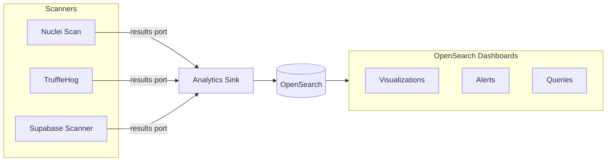

ShipSec Studio includes a workflow analytics system that indexes security findings into OpenSearch. This enables real-time dashboards, historical trend analysis, and alerting on security data.

---

## Overview

The analytics system consists of:

1. **Analytics Sink component** - Indexes workflow output data into OpenSearch
2. **Results output port** - Structured findings from security scanners
3. **OpenSearch storage** - Time-series index for querying and visualization
4. **View Analytics button** - Quick access to filtered dashboards

---

## Architecture



Each scanner outputs findings through its `results` port, which connects to the Analytics Sink. The sink indexes each finding as a separate document with workflow metadata.

---

## Document Structure

Indexed documents follow this structure:

```json
{
  "check_id": "DB_RLS_DISABLED",
  "severity": "CRITICAL",
  "title": "RLS Disabled on Table: users",
  "resource": "public.users",
  "metadata": "{\"schema\":\"public\",\"table\":\"users\"}",
  "scanner": "supabase-scanner",
  "asset_key": "abcdefghij1234567890",
  "finding_hash": "a1b2c3d4e5f67890",
  "shipsec": {
    "organization_id": "org_123",
    "run_id": "shipsec-run-xxx",
    "workflow_id": "d1d33161-929f-4af4-9a64-xxx",
    "workflow_name": "Supabase Security Audit",
    "component_id": "core.analytics.sink",
    "node_ref": "analytics-sink-1"
  },
  "@timestamp": "2025-01-21T10:30:00.000Z"
}
```

### Field Categories

| Category | Fields | Description |
|----------|--------|-------------|
| Finding data | `check_id`, `severity`, `title`, etc. | Scanner-specific fields at root level |
| Asset tracking | `scanner`, `asset_key`, `finding_hash` | Required fields for analytics |
| Workflow context | `shipsec.*` | Automatic metadata from the workflow |
| Timestamp | `@timestamp` | Indexing timestamp |

<Note>
  Nested objects in findings are automatically serialized to JSON strings to prevent OpenSearch field explosion (1000 field limit).
</Note>

---

## `shipsec` context fields

The Analytics Sink automatically adds workflow context under the `shipsec` namespace:

| Field | Description |
|-------|-------------|
| `organization_id` | Organization that owns the workflow |
| `run_id` | Unique identifier for this workflow execution |
| `workflow_id` | ID of the workflow definition |
| `workflow_name` | Human-readable workflow name |
| `component_id` | Component type (always `core.analytics.sink`) |
| `node_ref` | Node reference in the workflow graph |
| `asset_key` | Auto-detected or specified asset identifier |

---

## Finding Hash for Deduplication

The `finding_hash` is a stable 16-character identifier that enables tracking findings across workflow runs.

### Purpose

- **New vs recurring**: Determine if a finding appeared before
- **First-seen / last-seen**: Track when findings were first and last detected
- **Resolution tracking**: Findings that stop appearing may be resolved
- **Deduplication**: Remove duplicates in dashboards across runs

### Generation

Each scanner generates the hash from key identifying fields:

| Scanner | Hash Fields |
|---------|-------------|
| Nuclei | `templateId + host + matchedAt` |
| TruffleHog | `DetectorType + Redacted + filePath` |
| Supabase Scanner | `check_id + projectRef + resource` |

Fields are normalized (lowercase, trimmed) and hashed with SHA-256, truncated to 16 hex characters.

---

## Querying Data

### Basic Queries (KQL)

```
# Find all findings for an asset
asset_key: "api.example.com"

# Filter by severity
severity: "CRITICAL" OR severity: "HIGH"

# Filter by scanner
scanner: "nuclei"

# All findings from a specific workflow run
shipsec.run_id: "shipsec-run-abc123"

# Filter by organization
shipsec.organization_id: "org_123"

# Filter by workflow
shipsec.workflow_id: "d1d33161-929f-4af4-9a64-xxx"
```

### Tracking Findings Over Time

```
# Track a specific finding across runs
finding_hash: "a1b2c3d4e5f67890"

# Find recurring findings (multiple runs)
# Use aggregation: group by finding_hash, count occurrences
```

### Common Aggregations

| Aggregation | Use Case |
|-------------|----------|
| `terms` on `severity` | Count findings by severity |
| `terms` on `scanner` | Count findings by scanner |
| `terms` on `asset_key` | Most vulnerable assets |
| `date_histogram` on `@timestamp` | Findings over time |
| `cardinality` on `finding_hash` | Unique findings count |

---

## Setting Up OpenSearch

### Environment Variables

Set these in your `worker/.env`:

```bash
OPENSEARCH_URL=http://localhost:9200
OPENSEARCH_USERNAME=admin
OPENSEARCH_PASSWORD=admin
```

Set this in your `frontend/.env`:

```bash
VITE_OPENSEARCH_DASHBOARDS_URL=http://localhost:5601
```

### Docker Compose

The infrastructure stack includes OpenSearch and OpenSearch Dashboards:

```bash
docker compose -f docker/docker-compose.infra.yml up -d opensearch opensearch-dashboards
```

### Index Pattern

After indexing data, create an index pattern in OpenSearch Dashboards:

1. Go to **Dashboards Management** > **Index Patterns**
2. Create pattern: `security-findings-*`
3. Select `@timestamp` as the time field
4. Click **Create index pattern**

<Warning>
  If you don't see `shipsec.*` fields in Available Fields after indexing, refresh the index pattern field list in Dashboards Management.
</Warning>

---

## Analytics API Limits

The analytics query API enforces sane bounds to protect OpenSearch:

- `size` must be a non-negative integer and is capped at **1000**
- `from` must be a non-negative integer and is capped at **10000**

Requests above these limits return `400 Bad Request`.

## Analytics Settings Updates

The analytics settings API supports partial updates:

- `analyticsRetentionDays` is optional
- `subscriptionTier` is optional

Omit fields you don’t want to change. The backend validates retention days only when provided.

---

## Using Analytics Sink

### Basic Workflow

1. Add a security scanner to your workflow (Nuclei, TruffleHog, etc.)
2. Add an Analytics Sink component
3. Connect the scanner's `results` port to the Analytics Sink's `data` input
4. Run the workflow

### Component Parameters

| Parameter | Description |
|-----------|-------------|
| **Index Suffix** | Custom suffix for the index name. Defaults to slugified workflow name. |
| **Asset Key Field** | Field to use as asset identifier. Auto-detect checks: asset_key > host > domain > subdomain > url > ip > asset > target |
| **Custom Field Name** | Custom field when Asset Key Field is "custom" |
| **Fail on Error** | When enabled, workflow stops if indexing fails. Default: fire-and-forget. |

### Fire-and-Forget Mode

By default, Analytics Sink operates in fire-and-forget mode:
- Indexing errors are logged but don't stop the workflow
- Useful for non-critical analytics that shouldn't block security scans
- Enable "Fail on Error" for strict indexing requirements

---

## View Analytics Button

The workflow builder includes a "View Analytics" button that opens OpenSearch Dashboards with pre-filtered data:

- **When a run is selected**: Filters by `shipsec.run_id`
- **When no run is selected**: Filters by `shipsec.workflow_id`
- **Time range**: Last 7 days

The button only appears when `VITE_OPENSEARCH_DASHBOARDS_URL` is configured.

---

## Index Naming

Indexes follow the pattern: `security-findings-{orgId}-{suffix}`

| Component | Value |
|-----------|-------|
| `orgId` | Organization ID from workflow context |
| `suffix` | Custom suffix parameter, or date (`YYYY.MM.DD`) |

Example: `security-findings-org_abc123-2025.01.21`

---

## Building Dashboards

### Recommended Visualizations

| Visualization | Description |
|---------------|-------------|
| **Findings Over Time** | Line chart with `@timestamp` on X-axis, count on Y-axis |
| **Severity Distribution** | Pie chart with `terms` on `severity` |
| **Top Vulnerable Assets** | Bar chart with `terms` on `asset_key` |
| **Findings by Scanner** | Bar chart with `terms` on `scanner` |
| **New vs Recurring** | Use `finding_hash` cardinality vs total count |

### Alert Examples

| Alert | Query |
|-------|-------|
| Critical finding detected | `severity: "CRITICAL"` |
| New secrets exposed | `scanner: "trufflehog"` |
| RLS disabled | `check_id: "DB_RLS_DISABLED"` |

---

## Troubleshooting

### Data not appearing in OpenSearch

1. Check worker logs for `[OpenSearchIndexer]` messages
2. Verify `OPENSEARCH_URL` is set in worker environment
3. Ensure Analytics Sink is connected to a `results` port
4. Check if OpenSearch is running: `curl http://localhost:9200/_cluster/health`

### Field mapping errors

If you see "Limit of total fields [1000] has been exceeded":
1. Delete the problematic index: `curl -X DELETE "http://localhost:9200/security-findings-*"`
2. Re-run the workflow (new index will use correct schema)

### shipsec fields not visible

1. Fields starting with `_` are hidden in OpenSearch UI
2. Ensure you're using `shipsec.*` (no underscore prefix)
3. Refresh the index pattern in Dashboards Management

### pm2 not loading environment variables

pm2's `env_file` doesn't auto-inject variables. The worker uses a custom `loadWorkerEnv()` function in `pm2.config.cjs`. After changing `worker/.env`:

```bash
pm2 delete shipsec-worker
pm2 start pm2.config.cjs --only shipsec-worker
```

---

## Best Practices

### Do

- Connect `results` ports (not `rawOutput`) to Analytics Sink
- Use meaningful index suffixes for organization
- Monitor index size and implement retention policies
- Create saved searches for common queries

### Don't

- Don't connect deeply nested JSON (causes field explosion)
- Don't rely on analytics for critical workflow logic
- Don't store PII or secrets in indexed findings

---

## Component Author Guidelines

If you're building a security scanner component, see [Analytics Output Port](/development/component-development#analytics-output-port-results) for implementation details on adding the `results` output port.

---

## Related

- [Component Development](/development/component-development) - Building scanner components
- [Core Components](/components/core) - Analytics Sink reference
- [Analytics (PostHog)](/development/analytics) - Product analytics (different system)
