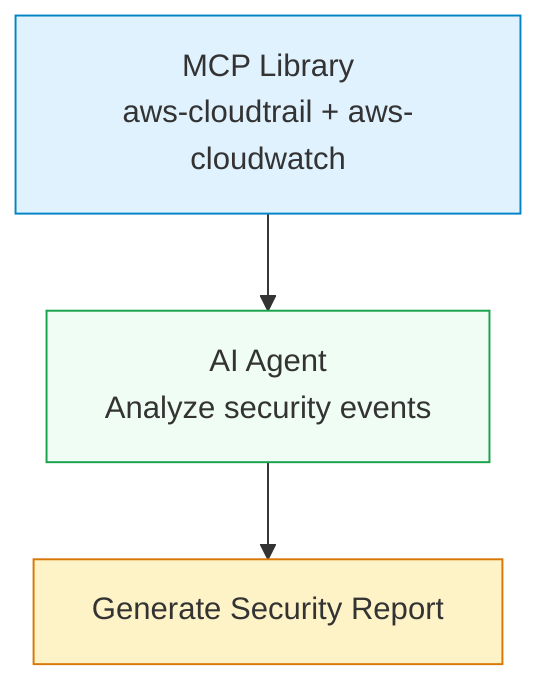
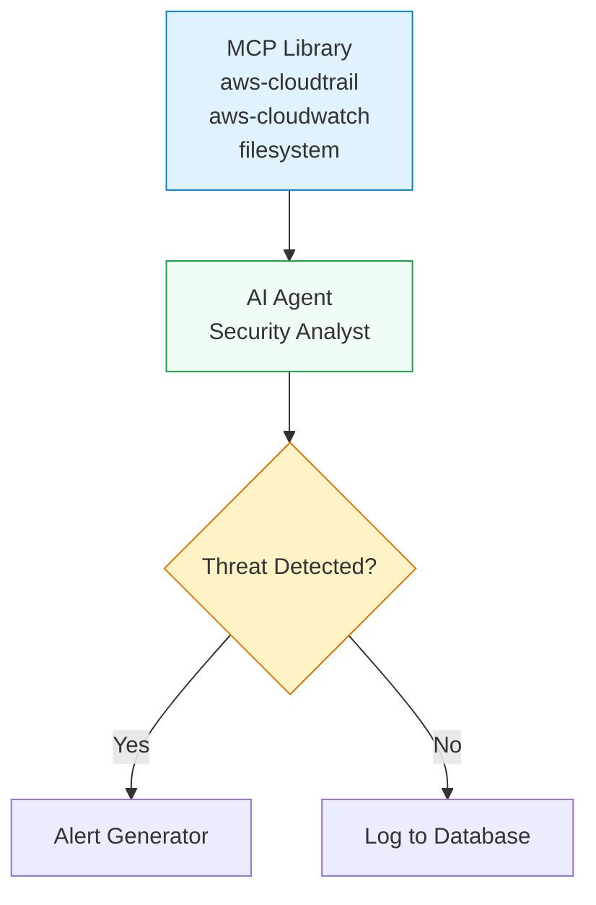

# MCP Library Component

## Overview

The MCP Library component provides a centralized way to select and enable multiple MCP servers without needing individual server nodes in your workflow. It simplifies the process of integrating multiple MCP servers by allowing you to choose from a library of available servers and automatically register their tools with the Tool Registry.

## Key Features

- **Multi-Server Selection**: Choose from available MCP servers through an intuitive interface
- **Automatic Tool Registration**: Tools from selected servers are automatically registered with the Tool Registry
- **Seamless AI Agent Integration**: Works with existing AI Agent components without any modifications
- **Dynamic Server Management**: Fetches server list from backend API with health status and tool counts
- **Docker Container Management**: Automatically spawns and manages containers for stdio servers

## Component ID: `core.mcp.library`

## Ports

**Outputs:**

- `tools` (contract: `mcp.tool`) - Anchor port for tool registration. Connect this to AI Agent's tools input.

## Parameters

- `enabledServers` (string[], default: `[]`) - Array of server IDs to enable. Multi-select interface fetches available servers from `/api/v1/mcp-servers`.

## Usage Guide

### 1. Add MCP Library Node

1. Open the workflow editor
2. Drag "MCP Library" from the "MCP" category in the component palette to your canvas
3. The node will appear with a single "tools" output port

### 2. Configure Servers

1. Click on the MCP Library node to open the configuration panel
2. The server list will load from the backend API, showing:
   - Server name and description
   - Health status (healthy/unhealthy/unknown)
   - Number of available tools
   - Enable checkbox for each server

3. Select the servers you want to enable:
   - **AWS CloudTrail** - Query AWS CloudTrail logs for API activity (15 tools)
   - **AWS CloudWatch** - Query AWS CloudWatch metrics and logs (8 tools)
   - **Filesystem** - Read and write local files (6 tools)
   - Additional servers as they become available

4. Click "Save" to apply the configuration

### 3. Connect to AI Agent

1. Drag a connection from the MCP Library's "tools" output port to an AI Agent's "tools" input port
2. The connection will show as a dashed line indicating it's using the `mcp.tool` contract
3. All tools from the selected servers are now available to the AI Agent

## Example Workflows

### Basic AWS Monitoring Workflow

This workflow demonstrates using MCP Library to query AWS CloudTrail and CloudWatch data.



**Steps:**

1. Add MCP Library node and select AWS CloudTrail + CloudWatch servers
2. Add AI Agent node and connect MCP Library tools to AI Agent tools
3. Add a Report Generator node to format the results
4. Configure the AI Agent to ask questions about security events

### Advanced Threat Detection Workflow

This workflow combines multiple MCP servers for comprehensive security analysis.



## Architecture

The MCP Library component follows this execution flow:

1. **Fetch Servers** - Makes GET request to `/api/v1/mcp-servers` to get available servers
2. **Filter Servers** - Only includes servers that are enabled and in the `enabledServers` list
3. **Spawn Containers** - For each stdio server:
   - Starts Docker container with MCP stdio proxy
   - Gets HTTP endpoint (e.g., `http://localhost:12345/mcp`)
4. **Register Tools** - POST to `/internal/mcp/register-local` for each server
5. **Tool Discovery** - AI Agent discovers tools via MCP Gateway

### Integration Points

- **Backend API** - `/api/v1/mcp-servers` (server list with metadata)
- **Internal API** - `/internal/mcp/register-local` (tool registration)
- **Tool Registry** - Redis (stores tool metadata and execution endpoints)
- **MCP Gateway** - `/mcp/gateway` (provides tool discovery/execution interface)

## Credential Management

### AWS Services

For AWS MCP servers (CloudTrail, CloudWatch), credentials are managed through environment variables:

#### Method 1: Environment Variables

```bash
# Set in your environment or docker-compose.yml
AWS_ACCESS_KEY_ID=your-access-key
AWS_SECRET_ACCESS_KEY=your-secret-key
AWS_REGION=us-east-1
AWS_SESSION_TOKEN=your-session-token  # Optional for temporary credentials
```

#### Method 2: Backend Configuration

Add to your backend environment configuration:

```bash
# backend/.env
AWS_ACCESS_KEY_ID=your-access-key
AWS_SECRET_ACCESS_KEY=your-secret-key
AWS_REGION=us-east-1
```

#### Method 3: AWS IAM Roles (Recommended for production)

When running in Docker, assign IAM roles to the containers:

```yaml
# docker-compose.yml
services:
  worker:
    environment:
      - AWS_ROLE_ARN=arn:aws:iam::123456789012:role/ShipSecWorkerRole
      - AWS_WEB_IDENTITY_TOKEN_FILE=/var/run/secrets/eks.amazonaws.com/serviceaccount/token
    volumes:
      - /var/run/secrets/eks.amazonaws.com/serviceaccount:/var/run/secrets/eks.amazonaws.com/serviceaccount
```

### Filesystem Server

The filesystem server provides access to:

- Temporary directories for each workflow run
- Shared volumes between containers
- Host file system (when explicitly configured)

**Security Note**: Filesystem access is scoped to the workflow's temporary directory by default for security.

## Server Selection Guide

### Choosing the Right Servers

| Server         | Best For                                               | Tools Available |
| -------------- | ------------------------------------------------------ | --------------- |
| AWS CloudTrail | API activity monitoring, security auditing, compliance | 15 tools        |
| AWS CloudWatch | Metrics, logs, alarms, real-time monitoring            | 8 tools         |
| Filesystem     | File operations, data processing, temp files           | 6 tools         |

### Health Status Indicators

- **Healthy** - Server is responsive and ready to accept requests
- **Unhealthy** - Server is not responding or experiencing issues
- **Unknown** - Health status could not be determined

## Troubleshooting

### Common Issues

**Servers Not Loading**

- Check backend API: `curl http://localhost:3000/api/v1/mcp-servers`
- Verify backend service is running
- Check network connectivity

**Tools Not Available to AI Agent**

- Ensure MCP Library is connected to AI Agent tools port
- Check Tool Registry for registered tools
- Verify MCP Gateway is running

**Container Spawning Failed**

- Check Docker is running and accessible
- Verify image exists: `shipsec/mcp-stdio-proxy:latest`
- Check container resource limits

### Debug Commands

```bash
# Check backend API
curl http://localhost:3000/api/v1/mcp-servers

# Check Tool Registry (if Redis CLI is available)
redis-cli GET tool:registry

# Check running containers
docker ps | grep mcp

# Check MCP Gateway health
curl http://localhost:3000/mcp/gateway/health
```

## Best Practices

1. **Start Small**: Begin with one server and gradually add more
2. **Monitor Health**: Regularly check server health status
3. **Use IAM Roles**: Prefer AWS IAM roles over access keys for production
4. **Resource Limits**: Monitor container resource usage
5. **Network Isolation**: Keep MCP servers isolated from production networks

## Future Enhancements

- [ ] Database-backed server configuration (PostgreSQL)
- [ ] Custom server registration (add your own MCP servers)
- [ ] Per-server credential management
- [ ] Health check polling and alerts
- [ ] Tool exclusion filters
- [ ] Server groups and templates
- [ ] Usage analytics and monitoring

## References

- [MCP Architecture Documentation](/docs/architecture.mdx)
- [AI Agent Component Documentation](/docs/ai-agent.md)
- [Component Development Guide](/docs/components.md)
- [ShipSec Studio Architecture](https://docs.shipsec.ai)
