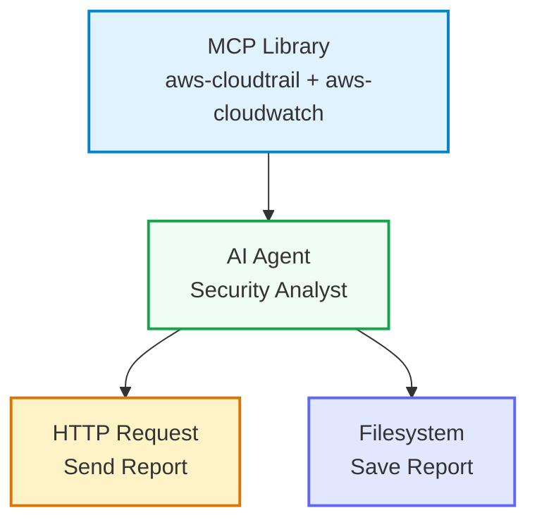
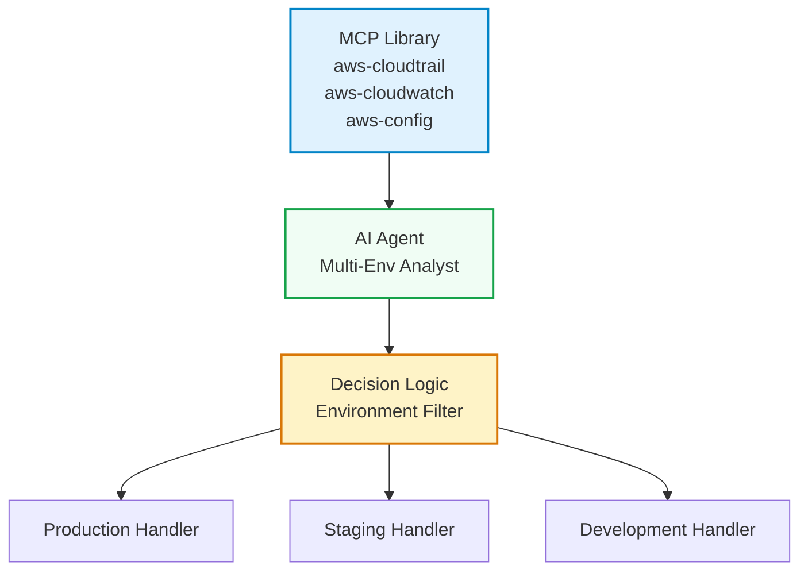

# MCP Library Example Workflow

This guide provides a complete example of using the MCP Library component with an AI Agent to create a security monitoring workflow.

## Overview

This workflow demonstrates how to:
1. Use MCP Library to enable multiple AWS services
2. Connect the MCP Library to an AI Agent
3. Analyze AWS CloudTrail and CloudWatch data for security events
4. Generate a comprehensive security report

## Workflow Architecture



## Step-by-Step Implementation

### 1. Create New Workflow

1. Open ShipSec Studio
2. Click "Create New Workflow"
3. Name the workflow "AWS Security Monitoring"

### 2. Add MCP Library Node

1. Drag "MCP Library" from the "MCP" category to the canvas
2. Position it on the left side of the canvas
3. Click on the node to open configuration

### 3. Configure MCP Library

1. In the configuration panel, select these servers:
   - ☑️ AWS CloudTrail - Query API activity logs
   - ☑️ AWS CloudWatch - Query metrics and logs
2. Click "Save" to apply the configuration

The node should now show "2 servers enabled"

### 4. Add AI Agent Node

1. Drag "AI Agent" from the "AI" category to the canvas
2. Position it to the right of the MCP Library
3. Double-click to open configuration

### 5. Configure AI Agent

Set the following prompt:

```prompt
You are a security analyst monitoring AWS services for security events.

Your task is to analyze AWS CloudTrail and CloudWatch data to identify:
- Unusual API activity patterns
- Authentication failures
- Resource access anomalies
- Security policy violations

For each finding, provide:
1. Description of the event
2. Severity level (Low/Medium/High/Critical)
3. Recommended action
4. Related AWS service

Respond in a structured format that can be easily parsed.
```

### 6. Connect Components

1. Drag a connection from MCP Library's "tools" output to AI Agent's "tools" input
2. The connection should show as a dashed line with "mcp.tool" label
3. Add an HTTP Request node (for sending reports) and a Filesystem node (for saving logs)

### 7. Configure Output Nodes

**HTTP Request Node:**
- Method: POST
- URL: https://your-webhook-url.com/security-alerts
- Headers: `Content-Type: application/json`
- Transform AI Agent output to webhook format

**Filesystem Node:**
- Operation: Write file
- Path: `/tmp/security-reports/aws-monitoring-{{timestamp}}.json`
- Content: AI Agent output

### 8. Save and Test

1. Click "Save Workflow"
2. Click "Run Workflow"
3. Monitor the logs to see:
   - MCP Library registering servers
   - AI Agent discovering and using tools
   - Security analysis in progress

## Complete Configuration

### MCP Library Parameters

```json
{
  "enabledServers": ["aws-cloudtrail", "aws-cloudwatch"]
}
```

### AI Agent Configuration

**Prompt:**
```
You are a security analyst monitoring AWS services for security events.

Your task is to analyze AWS CloudTrail and CloudWatch data to identify:
- Unusual API activity patterns
- Authentication failures
- Resource access anomalies
- Security policy violations

For each finding, provide:
1. Description of the event
2. Severity level (Low/Medium/High/Critical)
3. Recommended action
4. Related AWS service

Respond in JSON format:
{
  "findings": [
    {
      "description": "string",
      "severity": "string",
      "action": "string",
      "service": "string"
    }
  ],
  "summary": {
    "total_findings": number,
    "critical_count": number,
    "high_count": number
  }
}
```

### Example AI Agent Response

```json
{
  "findings": [
    {
      "description": "Multiple authentication failures from unusual IP address",
      "severity": "High",
      "action": "Block IP address and investigate potential brute force attack",
      "service": "CloudTrail"
    },
    {
      "description": "IAM user created with elevated permissions",
      "severity": "Critical",
      "action": "Revoke immediate access and audit user creation process",
      "service": "CloudTrail"
    }
  ],
  "summary": {
    "total_findings": 2,
    "critical_count": 1,
    "high_count": 1
  }
}
```

## Advanced Example: Multi-Environment Monitoring

This example extends the basic workflow to monitor multiple AWS environments.

### Workflow Architecture



### Implementation Steps

1. **Add Additional Servers** to MCP Library:
   - AWS Config - For configuration compliance checks

2. **Enhance AI Agent Prompt**:

```prompt
You are a security analyst monitoring multiple AWS environments. Analyze data from:
- Production: AWS CloudTrail and CloudWatch
- Staging: AWS CloudTrail and CloudWatch
- Development: AWS CloudTrail and CloudWatch

For each environment, identify security events and provide:
1. Environment-specific findings
2. Cross-environment patterns
3. Priority-based recommendations

Respond in JSON format including environment context.
```

3. **Add Decision Logic Node**:
   - Parse AI Agent output
   - Route findings to appropriate handlers based on environment and severity

4. **Create Environment-Specific Handlers**:
   - Production: Immediate alerts, integration with SIEM
   - Staging: Moderate alerts, team notifications
   - Development: Low priority alerts, logging only

## Troubleshooting Tips

### Tools Not Available

1. **Check Connection**: Ensure MCP Library "tools" port is connected to AI Agent
2. **Verify Registration**: Look for "Registered tools from server" in logs
3. **Check Server Status**: Verify selected servers are enabled

### AI Agent Can't Use Tools

1. **Prompt Clarity**: Ensure prompt explicitly mentions using available tools
2. **Tool Names**: Check actual tool names returned from MCP servers
3. **Error Messages**: Look for tool-specific errors in logs

### Performance Issues

1. **Tool Count**: Limit to essential servers (CloudTrail + CloudWatch = 23 tools)
2. **Timeout**: Increase AI Agent timeout for complex analyses
3. **Batch Processing**: Process findings in batches for large datasets

## Best Practices

1. **Start Simple**: Begin with one server and gradually add more
2. **Monitor Performance**: Watch for timeouts with large tool sets
3. **Secure Credentials**: Use AWS IAM roles instead of access keys
4. **Regular Updates**: Keep MCP server packages updated
5. **Testing**: Test with sample data before full deployment

## Related Documentation

- [MCP Library Component Documentation](/mcp-library.md)
- [AI Agent Component Documentation](/docs/ai-agent.md)
- [AWS Credential Management](/mcp-library.md#credential-management)
- [Component Development Guide](/docs/components.md)